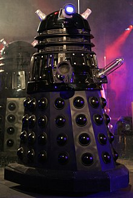
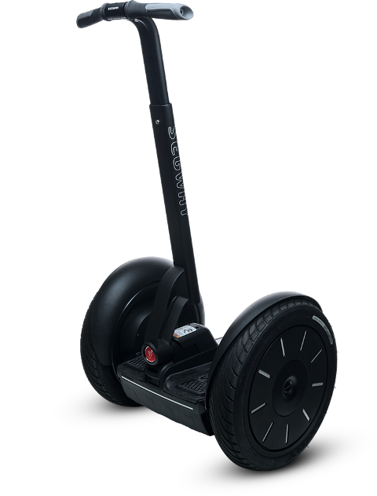

The game will be a multiplayer horror game. 

It will be a post-apocalyptic setting, the robots have taken over

The maze is a dystopian coliseum, where robots hunt and kill humans for fun, with the promise that if the human escapes, they will get to live on happily

They are slow-moving and few and far between in the maze (they are not allowed in the center). They speak condescendingly to the humans while they hunt them. They taunt them, etc then rip them apart. 

They slowly approach the human and then chase them at high-speed. If the human can get away from the robot for 30 seconds, the robot will give up and say 'you're no fun' and go in the opposite direction

inspiration:

</img></img>

Robots light up the maze like [this](https://threejs.org/examples/#webgl_lights_pointlights2)
