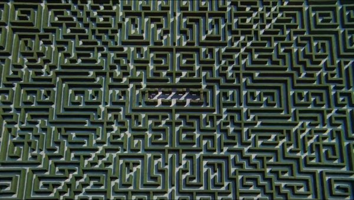
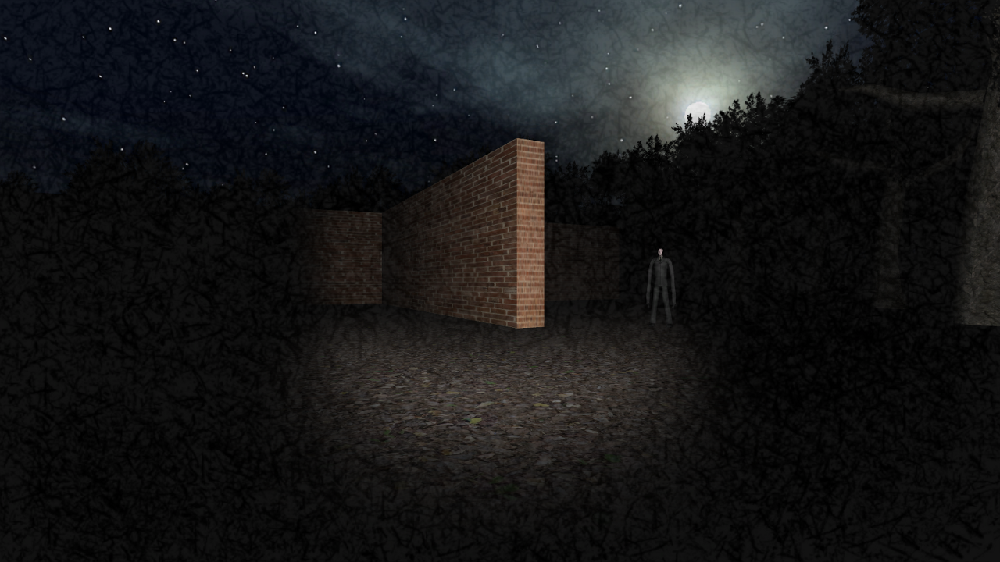

online maze where everydbody starts at the center and the game saves their progress. It should take like 1 month or so of deidcated work to get out of the maze.

there is pubg voice chat so players can tell other players about the path that they have travelled up to that point - either to deceive or to help.

people could leave notes around the maze (maybe they fade over days/hours). 

procedural generation of the maze

u know u reached the border but not the end

we should record the whole game to be played back later

show a percentage of the maze that has been explored up to that time + leaderboard + metrics (cool metrics, like in ready player one)

center room shows stats

sound adjustment based on physical surroundings, people make sounds when the bump into walls, you can hear super faintly through walls

on your journey, u need to follow sounds and murmurs in order to find more advanced players to get information about the surroundings or more directions

maybe vehicles

changing walking speed

superpowers like radar and loud voice

should there be impending doom

incentivize travelling in groups. there should be monsters or something that can only be defeated by a group of people. exploring selfishness and greed, prisoner's dilemma type thing. trust and betrayal.

maybe u should be able to punch people, center of maze should be a safe zone.

maybe they should have a shitty map that gives them some sense of progress.

fast travel back to the centre of the map and rooms that u have already visited.

rooms are safe zones. 

maybe make it so that people can buy powerups to help them with the game.

WHATS SHOULD THE PLAYERS LOOK LIKE??

monetization: aesthetic/emotes, maybe the people should be able to buy new markers to teleport to around the maze.

everyone should have a marker that they can teleport around to.

what should happen when someone dies? should they drop loot? trust and betrayal.

most interesting part is social interaction.

massive trees that you see above the maze.

</img></img>

Shortcuts that cut out significant parts of the maze, think of like fill in the sentence puzzles in which people can find letters by exploring, or take the brute force approach around the short cut. You can also have only a certain number of tries to open a short cut, they take time to regen. Also how many teleport waypoints should you have. 


